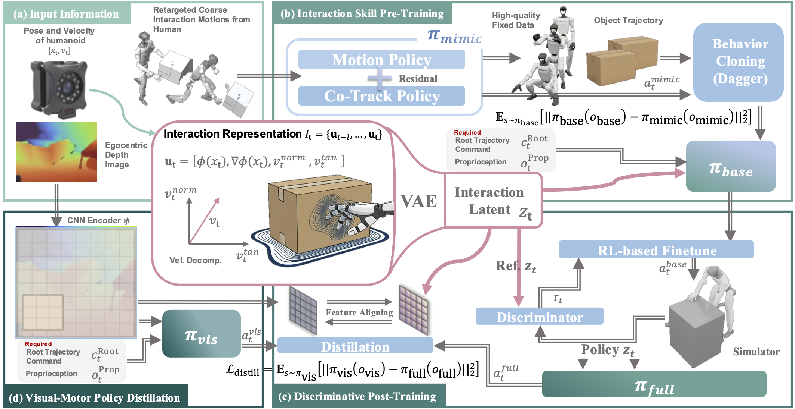

[](https://lessmimic.github.io)
<div id="top" align="left">

[](https://lessmimic.github.io/static/pdfs/lessmimic.pdf)
[](https://lessmimic.github.io/)
[](https://lessmimic.github.io/#live-demo-section)
</div>

# LessMimic: Long-Horizon Humanoid Interaction with Unified Distance Field Representations

[Yutang Lin](https://yutang-lin.github.io/)\*,
[Jieming Cui](https://jiemingcui.github.io/)\*,
[Yixuan Li](https://yixxuan-li.github.io/),
[Baoxiong Jia](https://buzz-beater.github.io/)&dagger;,
[Yixin Zhu](https://yzhu.io/)&dagger;,
[Siyuan Huang](https://siyuanhuang.com/)&dagger;

<sub>\* Equal contribution &nbsp; &dagger; Corresponding author</sub>

## Abstract

Humanoid robots that autonomously interact with physical environments over extended horizons represent a central goal of embodied intelligence. Existing approaches rely on reference motions or task-specific rewards, tightly coupling policies to particular object geometries and precluding multi-skill generalization within a single framework. Here we show that Distance Field (DF) provides such a representation: LessMimic conditions a single whole-body policy on DF-derived geometric cues — surface distances, gradients, and velocity decompositions — removing the need for motion references, with interaction latents encoded via a VAE and post-trained using AIP-derived RL. Through DAgger-style distillation that aligns DF latents with egocentric depth features, LessMimic further transfers seamlessly to vision-only deployment without motion capture infrastructure. A single LessMimic policy achieves 80-100% success across object scales from 0.4x to 1.6x on PickUp and SitStand where baselines degrade sharply, attains 62.1% success on 5-task trajectories, and remains viable up to 40 sequentially composed tasks. By grounding interaction in local geometry rather than demonstrations, LessMimic offers a scalable path toward humanoid robots that generalize, compose skills, and recover from failures in unstructured environments.

## Code

Code will be released. Stay tuned.

## Citation

```bibtex
@article{lin2026lessmimic,
  title={LessMimic: Long-Horizon Humanoid Interaction with Unified Distance Field Representations},
  author={Lin, Yutang and Cui, Jieming and Li, Yixuan and Jia, Baoxiong and Zhu, Yixin and Huang, Siyuan},
  journal={Preprint},
  url={https://lessmimic.github.io/}
}
```
